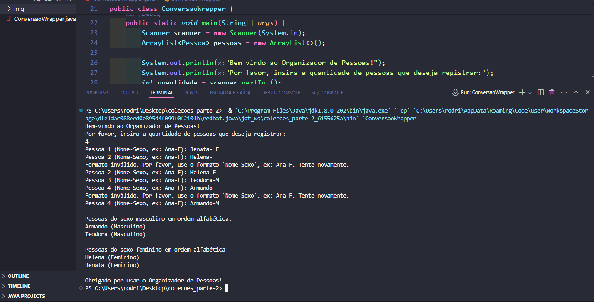
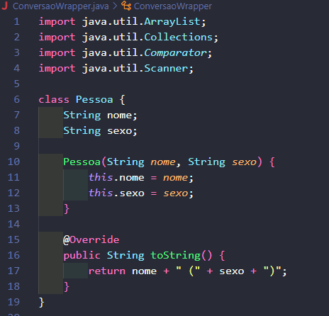
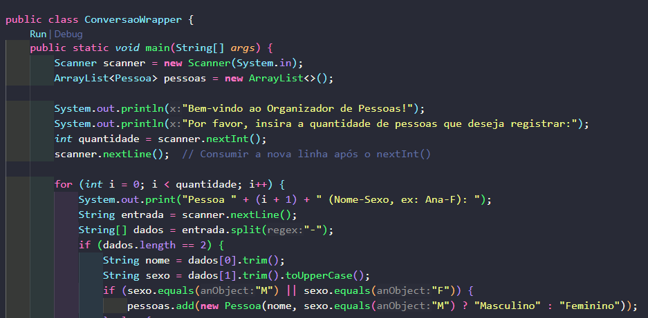
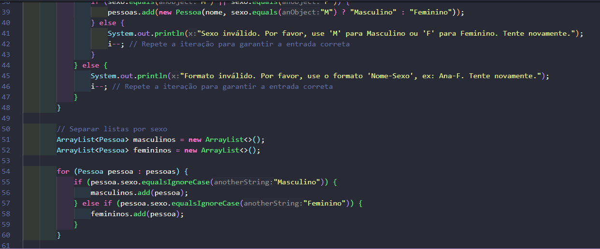

<!DOCTYPE html>
<html lang="pt-br">
<head>
    <meta charset="UTF-8">
    <meta name="viewport" content="width=device-width, initial-scale=1.0">
    <meta name="description" content=" ">
    <meta name="keywords" content="">
    <meta name="author" content="Ana Alice Rodrigues">
</head>
<body>

<header>
    <h1>Organizador de Pessoas</h1>
    
    
    
    
</header>

    
Índice

    <ol>
        <li><a href="#sobre-o-projeto">Sobre o projeto</a></li>
        <li><a href="#parte-tecnica">Parte Técnica</a></li>
        <li><a href="#estrutura-dos-arquivos">Estrutura dos Arquivos</a></li>
        <li><a href="#casos-de-uso">Casos de Uso</a></li>
        <li><a href="#ferramentas">Ferramentas</a></li>
        <li><a href="#contato">Contato</a></li>
    </ol>

<section id="sobre-o-projeto">
    <h2>Sobre o projeto</h2>
    

        O Organizador de Pessoas é um programa em Java que solicita ao usuário a quantidade de pessoas, lê os nomes e os sexos dessas pessoas, e as organiza em grupos de masculino e feminino, ordenados alfabeticamente. O objetivo é demonstrar como usar coleções, entrada de dados do usuário, e ordenação em Java.
    

    

        Proposta de Valor: Este programa pode ser útil em diversas situações, como organização de listas de presença, eventos, e qualquer outra situação onde a categorização e ordenação de pessoas seja necessária.
    

</section>

<section id="parte-tecnica">
    <h2>Parte Técnica</h2>
    <ul>
        <li><strong>Java:</strong> Linguagem de programação utilizada para desenvolver o programa.</li>
        <li><strong>Classes e Objetos:</strong> Utilização de classes para representar pessoas.</li>
        <li><strong>Coleções:</strong> Utilização de <code>ArrayList</code> para armazenar e manipular listas de pessoas.</li>
        <li><strong>Scanner:</strong> Utilização da classe <code>Scanner</code> para ler a entrada do usuário.</li>
        <li><strong>Ordenação:</strong> Utilização de <code>Collections.sort</code> e <code>Comparator</code> para ordenar as listas de pessoas.</li>
        <li><strong>Divisão de String:</strong> Utilização do comando <code>split</code> para dividir a entrada de dados.</li>
    </ul>
</section>

<section id="estrutura-dos-arquivos">
    <h2>Estrutura dos Arquivos</h2>
    <ul>
        <li><code>ConversaoWrapper.java</code>: Contém o código fonte do programa em Java.</li>
    </ul>
</section>

<section id="casos-de-uso">
    <h2>Casos de Uso</h2>
    <ul>
        <li>Organização de listas de presença.</li>
        <li>Ordenação de participantes de eventos.</li>
        <li>Qualquer situação onde a ordenação alfabética de nomes seja necessária.</li>
    </ul>
</section>

<section id="ferramentas">
    <h2>Ferramentas</h2>
    <ul>
        <li></li>
        <li></li>
        <li></li>
    </ul>
</section>

<section id="contato">
    <h2>Contato</h2>
    <ul>
        <li></li>
    </ul>

</section>

</body>
</html>

